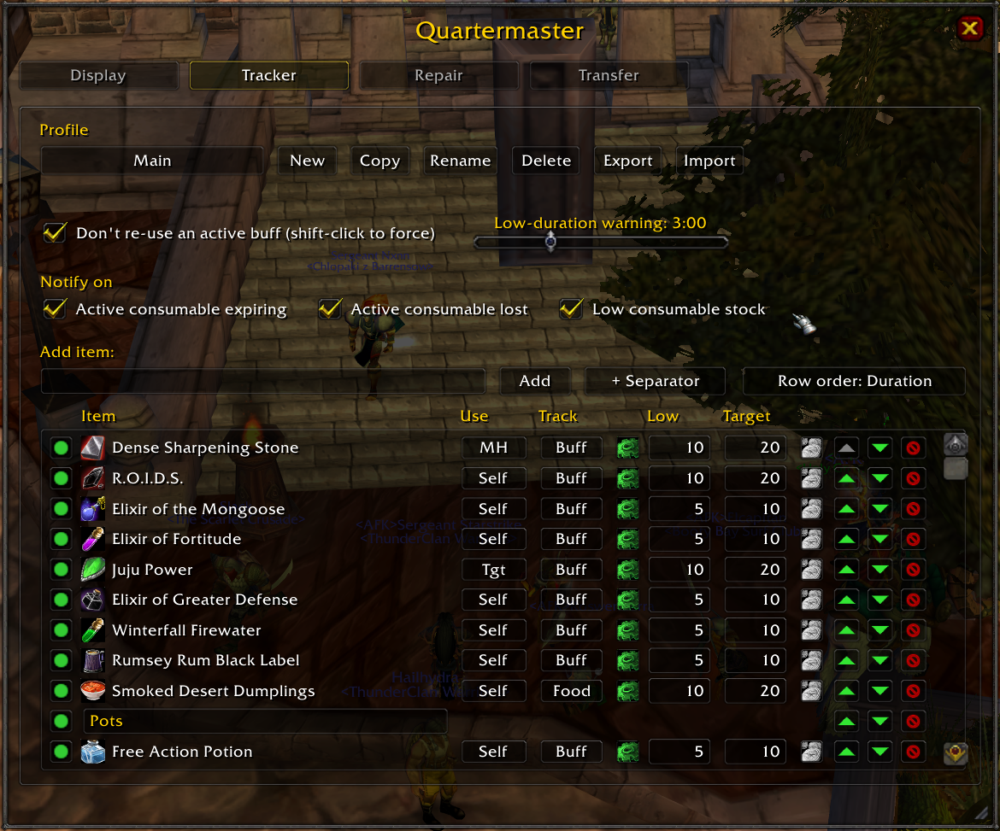
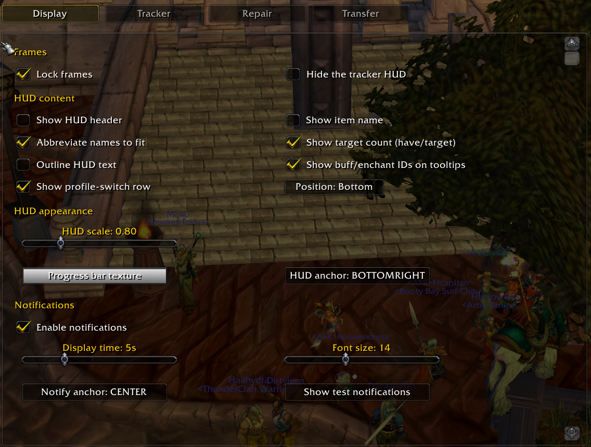
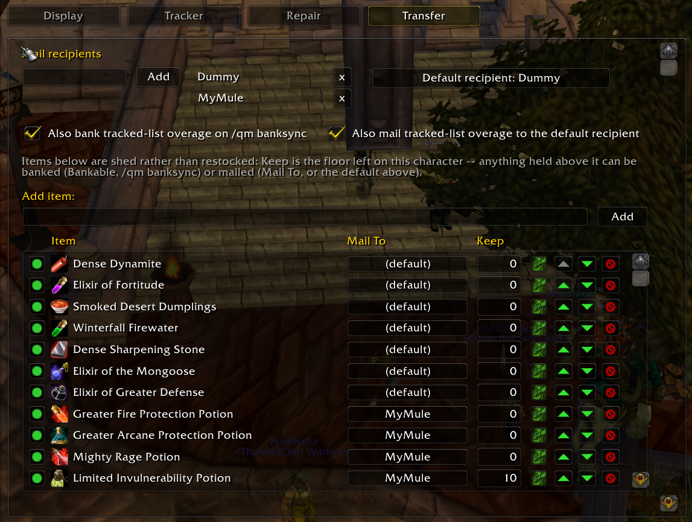
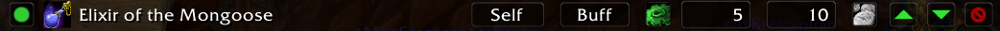
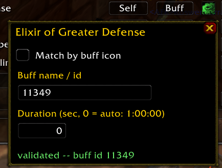
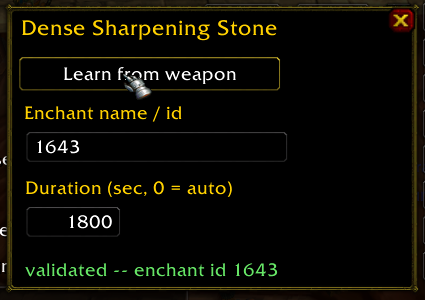
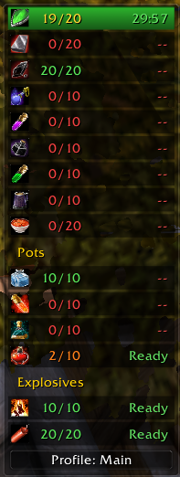
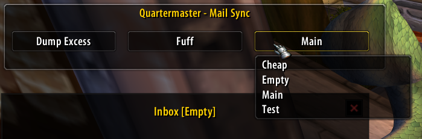
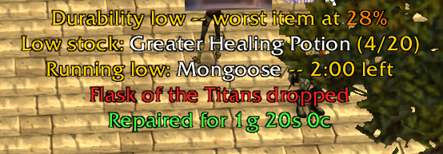
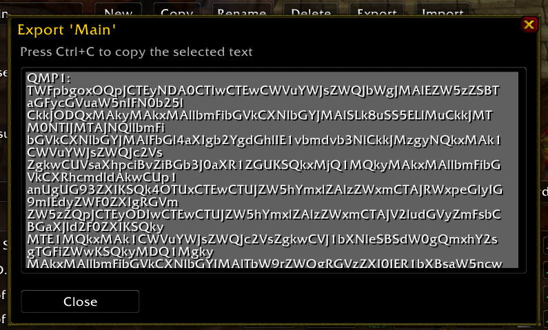

# Quartermaster

A personal raid-prep helper for the **World of Warcraft 1.12 client**. Quartermaster
centralizes four things that are otherwise spread across several addons — each with
full per-character control:

1. **Consumables** — a single desired list per character. Before the raid: do I have
   enough, and if not, where is the rest (this character's bags/bank, or another
   character)? During the raid: what's active, how much time is left, and a one-click
   **consume without opening a bag**.
2. **Reagents & stock items** — the same list also tracks plain item counts (reagents, explosives, pots) alongside the buffs, separated by category
   dividers, with an independent **auto-restock-at-vendor** option per item.
3. **Repair** — auto-repair at any repair-capable vendor, plus a gear-durability
   warning when your worst item drops below a threshold.
4. **Cross-character stocking** — raid consumables often live on a bank alt.
   Quartermaster's account-wide database lets any character see what the raid
   character wants and has, then move stock over by **mail** or **bank withdrawal**
   — and the reverse: a per-character list of items to proactively ship *off* a
   character via mail or bank deposit after the raid.

> **Status:** all of the above is implemented and in active use, but this addon has
> not yet been exercised through a full raid on every code path — treat it as a beta.
> See [CLAUDE.md](CLAUDE.md)'s "Open TODOs" if you're curious what polish is left.

---

## Contents

- [Environment & compatibility](#environment--compatibility)
- [Installation](#installation)
- [Quick start](#quick-start)
- [Slash commands](#slash-commands)
- [The config panel](#the-config-panel)
  - [Display tab](#display-tab)
  - [Tracker tab](#tracker-tab)
  - [Repair tab](#repair-tab)
  - [Transfer tab](#transfer-tab)
- [The item list editor](#the-item-list-editor)
- [The per-item gear popup](#the-per-item-gear-popup)
- [The in-raid tracker HUD](#the-in-raid-tracker-hud)
- [The mailbox panel](#the-mailbox-panel)
- [Notifications](#notifications)
- [Profiles: export & import](#profiles-export--import)
- [Tips & known limitations](#tips--known-limitations)
- [Development](#development)
- [License](#license)

---

## Environment & compatibility

Quartermaster targets the **1.12.1 client** as run on private "Turtle-style" servers
(built and tested against OctoWoW). It has no dependency on any other addon — it works
standalone out of the box — but it *detects* a few optional client patches and addons
at login and unlocks extra precision when they're present:

| Optional | What it unlocks | Without it |
| --- | --- | --- |
| **SuperWoW** (client-side patch) | Buffs can be matched by exact spell ID instead of icon/name, and the Display tab can inject spell IDs into buff tooltips as a discovery aid. | Buffs match by icon/name — reliable for the vast majority of items, just not disambiguated by ID. |
| **Nampower** (client-side patch, **v2.18+** for one feature) | Weapon temp-enchants (poisons/oils/stones) can be matched by exact enchant ID (`GetEquippedItem`), and item cooldowns read Nampower's shared-category cooldown info (e.g. one elixir putting sibling elixirs on cooldown). | Weapon enchants match by name instead of ID; item cooldowns fall back to a per-bag-slot read. |
| **ClassicAPI** (client-side patch) | The Display tab's buff-id tooltip injection can read a buff's exact spell ID directly off its aura data (`C_UnitAuras`). | The same tooltip injection falls back to other detection paths (SuperWoW's `GetPlayerBuffID`, Nampower's `UnitBuff`) — id discovery for the default Blizzard buff frame still works either way. |
| **TurtleMail** (addon) | Quartermaster always uses its own mail sequencer, but if TurtleMail is installed it routes each attach through TurtleMail's preserved original handler instead of the (TurtleMail-replaced) global one, so the two don't fight over the mailbox. | Quartermaster's sequencer drives the mailbox directly — mailing still works exactly the same. |
| **aux** (addon) | Quartermaster reuses aux's item name→ID index instead of building its own. | Quartermaster builds and maintains its own index by scanning the client's item cache — no action needed, just a bit more one-time work at first login. |

None of these are required, and nothing needs to be configured to enable them —
detection is automatic and silent.

The addon's own architecture and its use of any *other* local reference addons during
development (idioms borrowed while building it — distinct from the runtime detection
above) are documented in [CLAUDE.md](CLAUDE.md)'s "Reference addons" section — nothing
there needs to be installed to run Quartermaster.

## Installation

1. Download or clone this repository.
2. Copy the whole folder into your WoW installation's `Interface/AddOns/` directory
   so the path reads `Interface/AddOns/Quartermaster/Quartermaster.toc`.
3. Launch the game and enable **Quartermaster** on the AddOns screen at character
   select if it isn't already ticked.

A tagged release also builds a ready-to-extract `Quartermaster.zip` via CI
(`pack.ps1`) — grab that from the repository's Releases page if you'd rather not
clone.

## Quick start

1. Open the config panel with **`/qm`**.
2. On the **Tracker** tab, add the buffs, flasks, potions, and reagents you want
   tracked for your current character — shift-click an item link into the add box,
   drag an item from your bags onto it, or just type a name/ID.
3. Set a **Target** count for each (how many you want to be carrying) and, for
   consumables with a real up-time, a **Low** warning threshold.
4. Reload your UI (or just wait a moment) — the tracker HUD appears and starts
   showing your list. Left-click a row in the raid to consume that item.
5. Got a bank alt with your reagents? Open its bank, run **`/qm banksync`** on the
   character that needs stock, and it'll pull as much of its shortfall out of the open
   bank as is there — or open your mailbox and use the **Quartermaster_Mail** panel to
   mail stock across characters.

## Slash commands

The slash interface is intentionally minimal — almost everything else lives in the
config panel.

| Command | Effect |
| --- | --- |
| `/qm` or `/qm config` | Toggle the config panel. |
| `/qm lock` / `/qm unlock` | Lock or unlock all moveable frames (HUD, notification strip) against dragging. |
| `/qm show` / `/qm hide` | Show or hide the tracker HUD. |
| `/qm banksync` | Top up this character's tracked-list shortfall from an **open bank**, then (by default) bank any tracked-list overage and any bankable item on the Transfer list. Requires the bank window open. |
| `/qm prep` | Print the active list's shortfall to chat — what's short vs. Target, and how much of that is sitting in your bank or on other characters. Same report as the Tracker tab's **Prep** button. |
| `/qm mailsync dump` | Mail every Transfer-list item's excess above its Keep floor to its recipient (plus tracked-list overage to your default recipient, if set). Requires the mailbox open. |
| `/qm mailsync <character> [list]` | Mail *this* character's covering stock to help another character's shortfall on the given list (defaults to that character's active profile). Requires the mailbox open. |

## The config panel

`/qm` opens a tabbed panel (drag the title bar to move it, resize from the bottom-right
corner). The tabs split along one rule: **how things look/sit** lives on **Display**;
**what a feature does** lives on that feature's own tab.

### Display tab

Everything about appearance and on-screen placement, for both the tracker HUD and the
notification strip.

- **Frames:** *Lock frames*, *Hide the tracker HUD*.
- **HUD content:** *Show HUD header*, *Show item name*, *Abbreviate names to fit*, *Show
  target count (have/target)*, *Outline HUD text*, *Show buff/enchant IDs on tooltips*
  (a discovery aid for typing an exact match ID in the gear popup — see below).
- **Show profile-switch row** + a **Position** (Top/Bottom) drop — adds a
  profile-switcher to the HUD itself; only ever appears once the character actually
  has two or more profiles.
- **Show repair status row** + a **Position** (Top/Bottom) drop — adds a worst-equipped-
  durability gauge to the HUD. If it lands on the same edge as the profile-switch row,
  the profile row keeps the outermost spot and the repair row sits just inside it.
- **HUD appearance:** *HUD scale* slider, a *progress bar texture* picker (previews each
  candidate live on its own face), and a 9-point *HUD anchor* picker.
- **Notifications:** master *Enable notifications* toggle, *display time* and *font size*
  sliders, a 9-point *notify anchor* picker, and a **Show test notifications** button.

### Tracker tab

The single unified list — buffs, on-use items, and stocked reagents together — plus
everything about how the tracker behaves.

- A **Profile** row at the top: switch between named lists for this character, and
  **New / Copy / Rename / Delete / Export / Import / Prep** buttons (see
  [Profiles](#profiles-export--import) below). **Prep** opens a read-only report of the
  active list's shortfall vs. Target and where the rest of it is (bank / other
  characters) — the same report as `/qm prep`.
- **Don't re-use an active buff (shift-click to force)** — when on, clicking an
  already-active buff's HUD row does nothing unless you shift-click; stops an accidental
  double-use.
- **Low-duration warning** slider — how much time left on a buff counts as "running low"
  (shows orange on the HUD, can trigger a notification).
- **Notify on:** *active consumable expiring*, *active consumable lost*, *low consumable
  stock* toggles.
- **Row order** picker next to the add box: *Config* (the order you arranged them in),
  *Active* (currently-active items first), or *Duration* (soonest-to-expire first).
- The list itself — see [The item list editor](#the-item-list-editor).

### Repair tab

- **Auto-repair at vendors** — repairs your gear automatically the moment a
  repair-capable vendor window opens.
- **Notify on low durability** — raises a notification once your worst item's
  durability crosses the threshold below.
- **Durability warning below** slider (%).

### Transfer tab

The proactive-shed list — items you want to move *off* this character rather than
stock up on — plus recipient management. The live mail-sending controls themselves are
**not** here; they're on the [mailbox panel](#the-mailbox-panel), shown only while your
mailbox is actually open.

- **Mail recipients:** an add box for custom recipient names (mail can't cross realm or
  faction, so this is a manually maintained list alongside characters Quartermaster
  already knows about), each removable with its **x** button.
- **Default recipient** drop — the fallback for any row that doesn't set its own.
- **Also bank tracked-list overage on `/qm banksync`** / **Also mail tracked-list
  overage to the default recipient** toggles — an item you track for prep on the
  Tracker tab, once you're carrying more than its Target, can also be swept up by these
  two transfer actions without needing a separate Transfer-list entry.
- The list itself, using **Keep** in place of Target (the floor to leave behind — sync
  actions ship everything held above it) and a **Bankable** toggle in place of the
  restock coin (does `/qm banksync` bank this item's excess?). No Track/Use columns and
  no category dividers here — every row is a plain "ship the excess" instruction, and a
  **Mail To** picker replaces the Use column.

## The item list editor

Both the Tracker and Transfer tabs share the same row-based list editor.

Each row, left to right:

- A round **state chip** — click to cycle **enabled → hidden → off**. Enabled (green)
  is shown on the HUD and counted for restock/prep math. Hidden (amber) is counted but
  not shown. Off (grey) is fully ignored but stays in the list so you can flip it back
  on later.
- The item's **icon and name** (hover for the tooltip + item ID). Rows are
  drag-reorderable, or use the up/down arrow buttons.
- **Use** (Tracker) or **Mail To** (Transfer) — mutually exclusive, sharing one column.
  Use is how the item gets applied: **None** (count only — a stocked reagent), **Self**
  (potions/elixirs/flasks/food), **Tgt** (scrolls/jujus — cast on yourself despite the
  name), **Wpn** (applies to both weapons — stones/oils/poisons), **MH** / **OH**
  (main-hand/off-hand only). Mail To picks who a Transfer row ships to, overriding the
  tab's default recipient for just that row.
- **Track** (Tracker only, plus a gear icon next to it) — what kind of timer this item
  gets: **Buff** (tracks the buff/enchant's remaining time, falling back to the item's
  use cooldown once it drops), **CD** (cooldown only — healing/mana potions), **Food**
  (like Buff, but with a sit-and-eat progress bar before Well Fed lands), or **Stock**
  (no timer at all, just a carried-count gauge — the default for anything Quartermaster
  doesn't recognize as a usable consumable).
- **Low** (Tracker only) — the warning threshold: a remaining-duration cutoff for
  timed items, or a low-count cutoff for stock items.
- **Target** (Tracker) / **Keep** (Transfer) — how many you want to be carrying, or how
  many to leave behind when shedding excess.
- A **restock coin** (Tracker) or **bankable bag icon** (Transfer) in the same slot —
  gold/green when on. The restock coin opts this item into vendor auto-buying (up to
  Target, whenever you're at a merchant that sells it) independently of its Use mode —
  useful for a food you both eat *and* keep restocked. The bankable icon opts this item
  into `/qm banksync`'s bank-deposit pass.

**Adding items:** shift-click an item link into the "Add item" box, drag an item onto
the box or directly onto the list, or type a name/ID (an inline greyed ghost shows the
current best match; Tab cycles candidates, Enter/Add commits). Any item can be added —
anything Quartermaster doesn't recognize as a consumable just lands as a Stock count
row, so it's a fine way to track ore, cloth, or anything else you just want a running
tally of. On the Tracker tab, a **+ Separator** button next to Add inserts a category
divider you can label — it shows as a header band on the HUD and groups the rows below
it until the next divider.

## The per-item gear popup

Click the small gear icon on a Tracker-tab row (Buff/Food items only) to fine-tune how
Quartermaster recognizes that item's effect:

- **Match by buff icon** (self/target items) — matches purely by the buff's icon
  texture; usually the right default and needs no further setup.
- **Learn from weapon** (weapon/MH/OH items) — click, then apply the item to your
  weapon; Quartermaster captures exactly which temp-enchant appeared and remembers it,
  so it can tell your poison apart from someone else's on the same weapon.
- A **name/id** box for a manual override — type a buff name (or, with SuperWoW/Nampower
  present, a numeric spell/enchant ID for exact matching — turn on "Show buff/enchant
  IDs on tooltips" on the Display tab to read these off your own tooltips).
- A **duration** box (0 = auto-detect from the item's own tooltip).
- A status line telling you plainly whether the match is set, still waiting to see the
  effect for the first time, or confirmed working.
- For Food-tracked items only: the learned "still eating" signal and eat-time, with a
  **Reset eat learning** button if it ever needs to re-learn (e.g. after a patch changes
  the eating emote/aura).

 

## The in-raid tracker HUD

A small moveable panel (drag to move while unlocked, resize from the right edge) that
lists your active profile's enabled items as compact progress-bar rows, grouped under
any category dividers you've set up.

- **Stock rows** fill toward Target and shift red → orange → yellow → green as your
  carried count climbs past Low and Target.
- **Buff/CD rows** show remaining buff time (green fading to red once under your
  low-duration threshold), or the item's own cooldown once the buff drops. Food rows
  additionally show a blue eating-progress fill while a sit-and-eat session is running.
- An optional **repair status row** (Display tab) shows your worst equipped item's
  durability as a gauge, colored the same red/orange/green bands as the Repair tab's
  warning threshold. It's purely informational — repairing itself only happens at a
  vendor (auto or manual).
- **Left-click a row to consume that item** — no need to open a bag. If "don't re-use an
  active buff" is on and the buff still has plenty of time left, a plain click is a
  no-op (with a chat reminder); shift-click always forces it.
- The HUD hides itself automatically when empty, and — by default — while you're
  solo (not grouped); there's currently no config-panel toggle for the solo behavior,
  only the master `/qm show`/`/qm hide` and the Display tab's *Hide the tracker HUD*.

## The mailbox panel

While your mailbox is open, a small **Quartermaster_Mail** panel appears anchored above
it (draggable, but it re-anchors on every mailbox open rather than remembering a
position):

- **Dump Excess** — sends everything on your Transfer list above its Keep floor to its
  resolved recipient (same as `/qm mailsync dump`).
- A **character** picker, then a **profile** picker — choose another character (any of
  yours Quartermaster has seen, same realm/faction) and one of its lists; hovering
  previews what would be sent, and picking a profile sends immediately, mailing this
  character's covering stock to help fill that shortfall.

## Notifications

A small fading text strip (its look and position configured on the Display tab) that
feature modules raise into for time-sensitive warnings: an active consumable running
low or lost, a tracked item's stock running low, and low gear durability. Each category
has its own on/off toggle on the tab that owns it (Tracker for consumables, Repair for
durability) rather than a separate Notifications tab.

## Profiles: export & import

Each character can keep several named lists (e.g. a raid profile and a leveling
profile) and switch between them from the Tracker tab's Profile row. **Export** turns
the current profile into a compact text string (prefixed `QMP1:`) you can paste to
someone else or keep as a backup; **Import** turns that string back into a new profile
on whichever character you paste it into. It's plain data — never executed — so it's
safe to share in Discord/chat.

## Tips & known limitations

- The addon is entirely **account-wide** by design for its shared data (item
  metadata, mail recipients, cross-character visibility), but each character's desired
  list and Transfer list are its own — nothing is copied between characters
  automatically except by an explicit mail/bank action or a profile export/import.
- Mail actions only ever run while the relevant window (bank or mailbox) is actually
  open, and only move what's really there — nothing queues up passively in the
  background.
- Vendor auto-restock only buys what a per-item **restock** toggle has opted in; there's
  no per-item way to disable auto-*repair* similarly, since that's an all-or-nothing
  character setting on the Repair tab.

## Development

Contributor-facing architecture notes, the SavedVariables data model, 1.12 client
gotchas, and comment/style conventions live in [CLAUDE.md](CLAUDE.md). That file also
has a dedicated section naming the other local addons referenced during development
(idioms borrowed, or — for TurtleMail and aux — the runtime compatibility described
above); none of them are required to build or run this addon.

## License

MIT — see [LICENSE](LICENSE).
